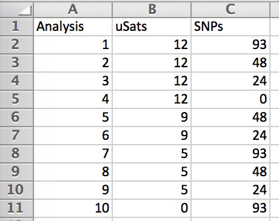
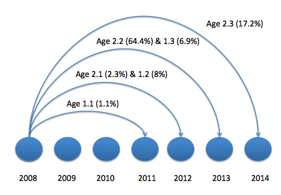
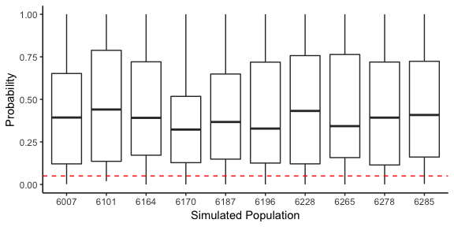
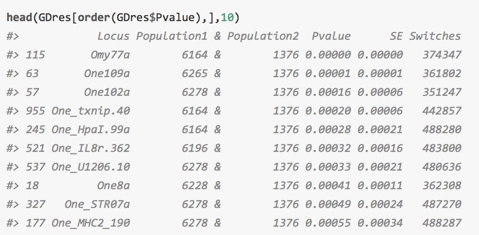
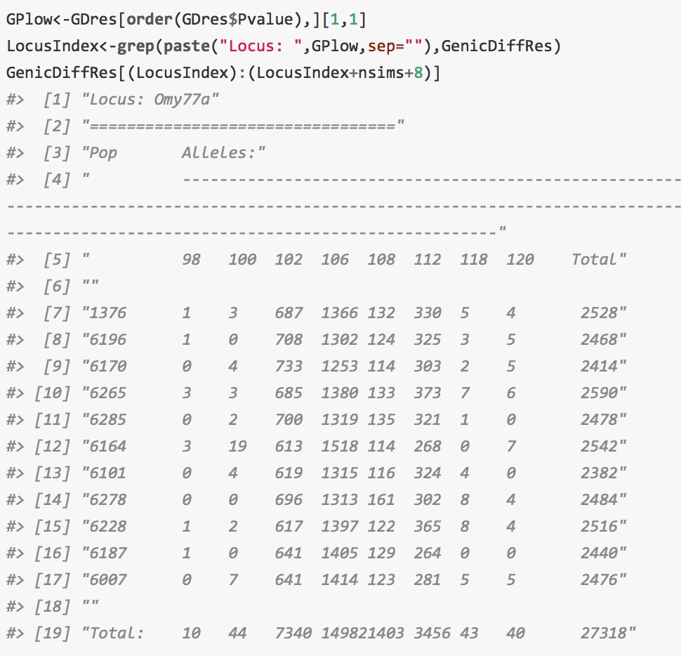
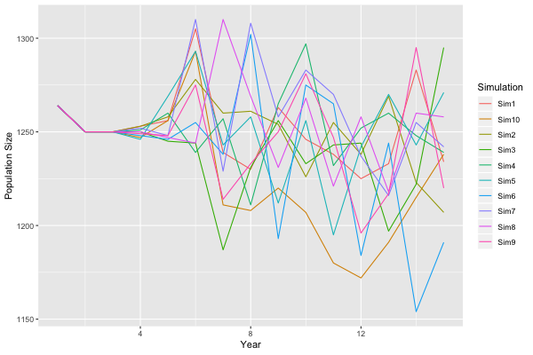
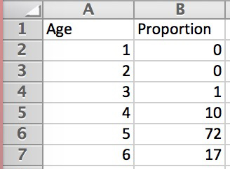
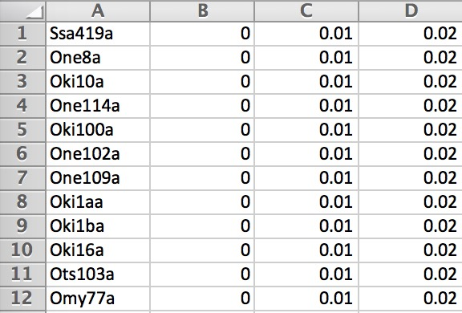

# Introduction to PseudoBabies
Genetic data can be used to infer genealogical relationships (parentage and sibship) among individuals when pedigree information is lacking. The proportion of the population sampled and the genetic loci surveyed are two important aspects of designing experiments which aim to infer these relationships. *PseudoBabies* is a flexible forward-in-time simulation library to aid in the evaluation of genetic marker panels. We used genetic data from a population of sockeye salmon (*Oncorhynchus nerka*) in Southeast Alaska to demonstrate its application.

# Getting started
## Installing the package
*PseudoBabies* was developed on R version 3.4.1. So first make sure you have a recent version of R. The easiest way to check for the version installed is with the command: 
```r
R.version.string
```
If you see anything that is $>=$ R version 3.4.1 you should be good to go. 

Most packages used in R are hosted on the comprehensive R archive network (CRAN) and you can installed them by with the `install.packages()` command. I haven't gone to the trouble to format the package for CRAN, nor do I think that the number of people that may want to use the package will require this, but only time will tell. For the time being, *PseudoBabies* will be hosted on github:

https://github.com/patbarry6/PseudoBabies

You can install it by using the package *devtools* with the command:
```r
library("devtools")
install_github("patbarry6/PseudoBabies")
library("PseudoBabies")
```
*PseudoBabies* has gone through a few rounds of updates and has been tested on Linux, MacOS X and Windows operating systems, but like all programs it may have a few issues to work out. If you download the library and run into issues there are a multitude of ways to resolve them. 


## Getting help
### Help from within R
If you have a problem with a particular function, you can get help with the ? operator and the function that you have a question about ie.
```r
?lm
```
this is equivalent to the `help()` function. This only works if you know the functions name. The `apropos()` function searches for objects, including functions, that include the character string in the search.

### Help on the Internet
As R has become embraced by many fields there has been an explosion of sites that are devoted to troubleshooting issues that people have with different packages. The websites search.r-project.org and Rseek.org are good resources that specalize in R. Similarly, there are mailing lists and forums that people can email or post their issues in the hopes that someone will respond with constructive solutions. The [R-help](https://stat.ethz.ch/mailman/listinfo/r-help) is the main R mailing list and is quite active. Forums, such as [Stack Overflow](http://stackoverflow.com/questions/tagged/r), are also popular ways of getting solutions to issues encountered. Much of the time solutions to your problem have already been posted, so doing a little bit of searching before posting is highly recommended.

### Help from the developer {#help}
*PseudoBabies* is hosted on github which makes it very easy for researchers using the program to fork the repository and help develop the code or post questions / issues. If you do not have a github account you can always email the developer directly pdbarry@gmail.com. It is likely that direct communication with the developer will be the fastest way to resolve issues. 

## Installing *COLONY* and *FRANz*
*PseudoBabies* does not do the heavy lifting of inferring parentage. There are a plethora of software avaialbe depending on the genetic markers used in the study. The programs *COLONY* (Jones & Wang2009) and *FRANz* (Riester et al. 2009) are two of the most commonly used and have the added benefit of being written so that arguments can be passed completely through the terminal or cmd line making them amenable to batch processing. The progrmas themselves can be run through R iterating through all the simulations, but the two programs must be installed and you need to know the path to each. 

*COLONY* (Jones & Wang 2009) can be found at the ZSL institute of zoology website: https://www.zsl.org/science/software/colony. It is important to get the most recent version $>= v2.0.6.5$. If you get an error about the input file it is likely the input format has changed slightly and you are not using an up to date version or a new version of *COLONY* has been released and the formatting that *PseudoBabies* uses needs to be updated. Once you have installed the program make a note of the path to the executable. 

*FRANz* (Riester et al. 2009) can be found at the Bioinformatics Leipzig page: http://www.bioinf.uni-leipzig.de/Software/FRANz/About.html. There are good instructions on how to install FRANz in its manual. When FRANz installs you should be able to call it from the command line without specifiying the entire path. If you open the cmd line in a windows machine or the terminal on a UNIX machine and issue the command FRANz you should get the error `Error: Please specify input file.` If you are working on a Windows machine you may also need to install Perl https://www.perl.org/get.html. FRANz has a perl script bundled with it that facilitates the formatting of input files. You should also find the path to this script. It should resemble `FRANz-2.0.0/extras/input/csv.pl`. 

# Running Simulations 

## Input files
Before you run a simulation you need information about the distribution of alleles at each locus. A pilot study could be conducted to survey the variability at a number of loci. The input file consists of a .csv file where indivdiuals occupy each line. If the .csv file is opened in a spredsheet program such as excel or LibreOffice Calc the first column is an individual identifier and the remaining columns are their multilocus genotype with each allele listed separately:

{width=80%}

Missing data is acceptable and should be coded as a 0 in the file. If there is information on the sex of individuals this can be incorporated into the analysis and should be listed in the last column of the input file. 


## Run a simulation
### `CompleteGenotypes()`
With our genotypes in hand we may want to evaluate a number of marker panels with multiple levels of genotyping error and missing data. If we want to evaluate the effect of missing data on our ability to infer parentage we first want to clean up our dataset by filling in missing genotypes. The function `CompleteGenotypes()` can be used to sample from the allele frequency distribution for each locus to fill in missing data. We sampled 1264 sockeye salmon that returned to the Auke Creek weir in 2008 and genotyped them at 12 microsatellite and 93 single nucleotide polymorphism markers. 

```r
CompleteGenotypes(file="ACS2008_FullPanel.csv",
                  nloci=105,
                  StartYear = "2008")
```
The `file` is the file of genotypic information, `nloci` is the number of loci included in the dataset, and `StartYear` is the year the simulation will start and is mostly used for accounting with overlapping generations. 

### `Sim.SG.Data()` and `Sim.MG.Data()`
Simulations are accomplished with one of two functions: `Sim.SG.Data()` and `Sim.MG.Data()`. The main difference between the two functions is that `Sim.SG.Data` takes  individual genotypes and performs a single round of matings whereas `Sim.MG.Data()` requires information on the distribution of ages at maturity and can be run for a number of years.  

Of our 105 genetic markers, three multiplexes were made for the uSat markers. We attempted to group uSat loci by information content while keeping PCR reagent concentrations similar. For SNP genotyping a Fluidigm system was used, which accommodates arrays that run 96, 48, or 24 loci. SNPs were organized by their minor allele frequency (MAF) and the SNPs with the highest MAF were retained on each of the three array sizes. We ran simulations that included a combination of 12, 9, 5, or 0 microsatellites and 93, 48, 24, or 0 SNPs. The loci to use in simulations were specified in the `Markerfile` a .csv that lists which markers should be included in the analysis:

{width=50%}

Sockeye salmon in Auke Creek can mature at ages 3 to 7. Scale samples were collected from a subset of returning fish so that we could estimate the distribuiton of ages at maturity. This information is stored in the age of maturity file (`AOMfile`; see [Additional Auxillary Files](#adfiles)) 

<center>

{width=40%}

</center>

For any return year, individuals could be progeny from matings that occured in four years. When sockeye return to the system to spawn individuals are sexed by their secondary sexual characteristics (size of kype and vent), but early in the return when fish are not fully sexually mature mistakes are not uncommon. As for the mating structure, it is not uncommon for sockeye females to mate with multiple males (polygyny), but the extent to which males mate with females (polyandry) is unknown. We can conduct our simulation with the command: 

```r
Sim.MG.Data(Founders='./FoundersCompleteGenotypes.csv',
            Markerfile='./MarkerPanels.csv',
            AOMfile="./AgeOfMaturity.csv",
            NumSNPs=93, NumuSats=12,
            NB=625,
            StartYear=2008, NumYears=15,
            nSim=10, 
            Geno_Error=T,ErrorVals=3,
            Miss_data=F, MissingVec=c(0,2.5),
            Programs=c('FRANz','Colony'), 
            perl.dir="/Users/patdbarry/Desktop/GeneticsSoftware/FRANz-2.0.0/extras/input/csv.pl",
            GPHomogeneity=T,
            OffspringDist="Poisson",lambda=2,
            SexInfo=F, MatingStr="Polygamy")
```

Let's look at each of the options in the `Sim.MG.Data()` function:

1. `Founders`: *Character* The file path of the genotypes with which you will start the simulation. 
2. `Markerfile`: *Character* - As demonstrated above this is the filepath to the .csv file to the marker panels that you wish to evaluate. 
3. `AOMfile`: *Character* The file path to the age at maturity for the population. see [Additional Auxillary Files](#adfiles)
4. `NumSNPs` & `NumuSats`: *Numeric* The number of SNP and microsatellite markers in the Founders file.
5. `NB`: *Numeric* The number of mating pairs that we will simulate offspring for at each year of the simulation. 
6. `StartYear`: *Numeric* Number for keeping track of all the years that are putative parents to the offspring collected in the final year of the simulation.
7. `NumYears`: *Numeric* How many years do you want the simulation to go before sampling the offspring and putative parents?
8. `nSim`: *Numeric* How many simulated datasets do you want to create?
9. `Geno_Error`: *Logical* Do you want to incorporate genotyping error into the simulations? see [Additional Auxillary Files](#adfiles)
10. `ErrorVals`: *Numeric* If `Geno_Error=TRUE` how many values of genotyping error do you want to use?
11. `Miss_data`: *Logical* Do you want to incorporate missing data into the analysis?
12. `MissingVec`: *Vector of Numeric* If `Miss_data=TRUE` how much missing data should exist in the input file?
13. `Programs`: *Character* You can choose 'FRANz' 'Colony' or c('FRANz','Colony').
14. `perl.dir`: *Character* If 'FRANz' is include in the `Programs`, this is the file path of the perl script csv.pl
15. `GPHomogeneity`: *Logical* Should we run a homogeneity test on the simulated datasets to make sure that our allele frequency distributions are terribly different than our founder population?
16. `OffspringDist`: *Character* What distribution should be used to generate the number of offspring for each of the `NB` mating pairs. 
    + `Poisson` must specify `lambda`
    + `NegativeBinomial` where `n=NB`, `size=NB` and you must specify prob as `nBprob`, see [NegBinomial](https://stat.ethz.ch/R-manual/R-devel/library/stats/html/NegBinomial.html) options. 
    + `Uniform` must specify a `Umin` and a `Umax`
17. `SexInfo`: *Logical* Do you have informaiton on the sex of each individual?
18. `MatingStr`: *Character* The mating structure
    + `monogomy` All individuals only mate with one other individual.
    + `polygamy` Individiuals can mate with multiple other individuals. If `SexInfo=TRUE` males can mate with many females and females can mate with many males. 
    + `polyandry` Females can mate with multiple males (only available if `SexInfo=TRUE`).
    + `polygyny` Males can mate with multiple females (only available if `SexInfo=TRUE`).

### Simulation diagnostics
Once the simulations have completed there are a few ways to evaluate if the simulations have produced data that resemble your founder population and may give you a good idea of your ability to infer parentage with the gentic markers available. First, becuase we run the simulation for a few years and the population size is finite there is the possiblity that through genetic drift the allele frequencies that you end up with will not reflect those you started with. If you used the `GPHomogeneity=TRUE` option then Genepop [@Rousset2008] will be run to compare the founder population with all the simulations. The results from this analysis will be in your working directory in the file `SimGenicDiff.txt`. We can do a quick plot of the p-values for all the tests that compare the founder population with all the simulations. If we see the p-values centered around anything < 0.05 then we may have an issue. 

To do this we will pull all the lines from the output file that compare the founder population 1376 with the simulated populations. 

```r
nsims<-10
nloci<-105
GenicDiffRes<-readLines("./data/SimGenicDiff.txt")
LociIndex<-grep("Locus        Population pair        P-Value  S.E.     Switches",GenicDiffRes)
PopIndex<-grep("1376",GenicDiffRes)

GDres<-lapply(1:length(LociIndex),function(LI) PopIndex[(min(which(PopIndex > LociIndex[LI]))):(min(which(PopIndex > LociIndex[LI]))+(nsims-1))])%>%
  {GenicDiffRes[unlist(.)]}%>%
  str_split(string=.,pattern="\\s+")%>%
  unlist()%>%
  matrix(data=.,nrow=(nsims)*nloci,ncol=7,byrow=T)%>%
  as.data.frame()

colnames(GDres)<-c("Locus", "Population1","&","Population2", "Pvalue",  "SE", "Switches")

ggplot(data=GDres[order(as.numeric(GDres[,5])),],
       aes(x=Population1,y=as.numeric(as.character(Pvalue))))+
  geom_boxplot()+
  ylab("Probability")+
  xlab("Simulated Population")+
  theme_classic()+
  geom_hline(yintercept=0.05,lty=2,color="red")
```
{width=40%}

Not too bad, there are a few values that fall below our alpha value of 0.05. You may want to correct for multiple testing. You can also sort the dataframe by the probability value and look for any simulations that are significantly different at multiple loci and consider trashing that simulation.

```r
head(GDres[order(GDres$Pvalue),],10)
```
{width=80%}


Well shoot, the locus Omy77 has a probability of 0 for population 6164. How divergent are the allele frequencies? To figure this out we can pull the allele frequency distribution from the output file:

```{r GPlow, cache=T}
GPlow<-GDres[order(GDres$Pvalue),][1,1]
LocusIndex<-grep(paste("Locus: ",GPlow,sep=""),GenicDiffRes)
GenicDiffRes[(LocusIndex):(LocusIndex+nsims+8)]

```

{width=80%}

So it appears that allele 100 at this locus has become much more frequent in this population and that is what is cuasing the heterogeneity between the founding populaiton and this simulation. One solution to this issue is to simulate 10% more simulations than desired and then trash the ones that are most dissimilar to your data. 

A further issue is that we need to specify both the number of breeding pairs per year and a distribution to generate the number of offspring that those breeders produce. If we choose unrealistic values for these parameters we can drastically increase or decrease the size of the population. To make sure that our population size hovers around a reasonable value for the population of interest we produce a plot of the total population size at each iteration of the simulation, `PopulationSize_Simulations.jpg`: 

{width=80%}

You can see from this graph that the simulated populations end up being within about 100 individuals of the population size we started with. If you start with a founders file that has fewer individuals than the total population of interest you should choose `NB` and a distribution of offspring that will give you a reasonable population size for the system you are studying.  

## Inference with *COLONY* and *FRANz*
Once you have determined that the simulated datasets are good representations of your focal population we can use the programs *COLONY* and/or *FRANz* to do the actual inference. There are two main functions to run these programs through R: `Rn.Colony()` and `Rn.FRANz()`

```r
Rn.Colony(ColonyDir="/Users/patdbarry/Desktop/GeneticsSoftware/colony2",
          nSim=10, 
          Geno_Error=T,ErrorVals=3,
          Miss_data=F,Markerfile = "MarkerPanels.csv",
          ShowProgress=T)

Rn.FRANz(nSim=10, 
        Geno_Error = T, ErrorVals=T, 
        Miss_data = F, 
        Markerfile = "MarkerPanels.csv",
        ShowProgress=T)
```

The only new option here is `ShowProgress` which will use the package `tcltk` to keep track of the progress. In the even that the program is interupted and you need to re-start an analysis there are two funcitons that scan all the folders and look for results and then pick back up where the analysis left off:

```r
Resume.Rn.Colony(ColonyDir="/Users/patdbarry/Desktop/GeneticsSoftware/colony2",
                nSim=10, 
                Geno_Error=T,ErrorVals=3,
                Miss_data=F, 
                Markerfile = "MarkerPanels.csv",
                ShowProgress=T)

Resume.Rn.FRANz(nSim=10,
                Geno_Error=T,ErrorVals=3,
                Miss_data=T,
                Markerfile = "MarkerPanels.csv",
                ShowProgress=T)
```


## Summarizing results
During the simulations the folder `SimParents` is created that holds all the true parentages for the simulations. With this and all the results you can script your own analysis or you can use one of our functions to explore your results. Each of the known parents files has the offspring and their two true parents concatenated with an ampersand. The `stringr` package is a useful R library for text manipulation. The function `stringr::str_split()` is particularly useful for splitting apart text that is concatenated together.

### *COLONY* results - `SumColony()`
The program *COLONY* produces a lot of output. There are over 10 pages that detail the output files in the manual. We are most interested in the inferred parent paris for each offspring with probabilities that are obtained from the full likelihood method. This information is contained in the `*.ParentPair` file (where the * is the name of the simulation). The description of this file from the user guide:

>Each row has 4 columns, giving the offspringID, the inferred fatherID, the inferred motherID, and the probability of the inferred parent pair. If an offspring has several inferred parent pairs, they are listed in the order of the probabilities. Any inferred parent pair that has a probability smaller than 0.01 will not be listed. If paternity (maternity) is not assigned to any candidate, the fatherID (motherID) is indicated by “*” (“#”). For monoecious, unassigned parentage is indicated by “#”.

The function `SumColony()` summarizes the results from multiple runs of *Colony*. 

```r
SumColony(nSim=10,
          Geno_Error=T,
          Miss_data=F,
          Cutoff=0.95,
          Markerfile='MarkerPanels.csv',
          SavePlot=T,
          FacetWrapBy=c("Error"),
          ErrorLab=c("0%","1%" "2%")
```
Many of the arguments passed to this function should look familiar. In addition the presence of genotyping and missing data there are options for:

1. `Cutoff`: *Numeric* What is the cutoff value for parentage inference. Anything below this cutoff is not considered. 
2. `SavePlot`: *Logical* Do you want to save the plots of the correct assignment of individuals to their parent pair?
3. `FacetWrapBy`: *Character* can be `Panel`, `Error`, `MissDat`, or a combination of multiple.
4. `ErrorLab`: *Character* Labels for the legend when multiple values of error are used.

The function will return a dataframe with a summary of the analyses. 

### *FRANz* results - `SumFRANz()`
The program FRANz produces a few files. The most important file is `parentage.csv`. This lists the most likely parents of each individual. The most important information in this file according to [@Riester2009] is the LOD and the posterior probability columns. The arguments to this command are very similar to those to `SumColony()`:

```r
SumFRANz(nSim=10, 
         Miss_data = F, 
         Geno_Error = T, ErrorVals=3,
         Markerfile = "MarkerPanels.csv",
         Cutoff=0.95,SavePlot=TRUE,
         FacetWrapBy=c('Error'),ErrorLab=c("0%","1%" "2%"),
         LODplots=TRUE)
```

The only new option for this function is:
1. `LODplots`: *Logical* Do you want to plot the LOD values for indivdiuals that had 2, 1, and 0 incorrect parents inferred?

The function will return a dataframe with a summary of the analyses. 


## Optional Auxillary files {#adfiles}
### Age of Maturity `AOMfile`
The age of maturity file is a .csv file that outlines the proportion of the population that reproduces at a given age. The file has two columns; age and proportion. Although obvious, the proportion should sum to 1. There is no limit to the ages; however, ages should range from 1 to the maximum age for reproduction.  

{width=40%}

### Genotyping Error `Loci_error.csv`
If `Geno_Error=TRUE` then the .csv file `Loci_error.csv` needs to give genotyping error rates for all of the loci in the founders file. The error values can range from 0-1, though we hope that they aren't much greater than 0.02. Each locus can have its own genotyping error rate. You may want to give microsatellites a higher error rate than say SNPs. Multiple columns can exists and will be used for different `ErrorVals`. Because we allow different error rates across loci when plotting results we allow the user to define the label that is applied to the graphs `ErrorLab`. 

{width=40%}

# Considerations 
Depending on how large a population we are working with it may be computationally taxing to analyze your dataset with multiple panels and multiple levels of genotyping error and missing data all at once. The program *COLONY* can run for a very long time, so we advise doing an iterative analysis to minimize the number of datasets that you will analyze.

##Running multiple instances of Colony
You can speed up the processing time of *COLONY* by running multiple instances of it. With a UNIX operating system you can do that easily by running a bash script that iterates over multiple `MarkerPanel` files. Say you want to run 4 different marker panels for 3 levels of error. If your computer has 8 cores you could create multiple different Marker Panel files: `MarkerPanel1.csv`, `MarkerPanel2.csv`, etc. with a single panel in each file. Then you can run a bash script that opens R and issues a command to run the `Rn.Colony()` command and changes the MarkerPanel that is used for each analysis. If you are interested you can contact contact the author for an example (see  [Getting Help from the Developer](#help) ) 

# Future developments
1. Add output files for other parentage programs. 
2. The simulations currently take some time as the entire script is written in R. This makes the code easily adaptable by anyone that can read/write in the R programing language. Taking advantage of parallel processing should lead to substantial improvements in processing times. 


# References

Jones, O.R., and J. Wang. 2010. “COLONY: A Program for Parentage and Sibship Inference from Multilocus Gentype Data.” Molecular Ecology Resources 10 (3): 551–55.

Riester, M., P.F. Stadler, and K. Klemm. 2009. “FRANz: Reconstruction of Wild Multi-Generation Pedigrees.” Bioinformatics 25 (16): 2134–9. doi:10.1093/bioinformatics/btp064.

Rousset, F. 2008. “GENEPOP’007: A Complete Re-Implementation of the Genepop Software for Windows and Linux.” Molecular Ecology Resources 8 (1): 103–6. doi:10.1111/j.1471-8286.2007.01931.x.
