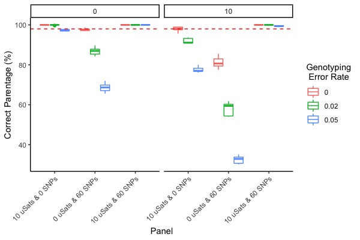

```{r setup, include = FALSE}
knitr::opts_chunk$set(
  eval = FALSE,
  collapse = TRUE,
  comment = "#>"
)
```

```{r load packages, include = FALSE}
library("tidyverse")
library("EnvStats")
library("PseudoBabies")
library("magrittr")
```

# Introduction
This vignette will lead you through some simple simulations with the 
PseudoBabies R package. It assumes you have already downloaded the 
required programs and installed PseudoBabies. If you haven't already 
done these things please see the GitHub readme or the Intro to PseudoBabies
vignette. 

# Simulating Genotypes
You may or may not have data that you are interested in analyzing for a parentage
or sibship study. Instead of providing a dataset, we can simulate some 
genetic data for a population of Fizzgigs. If you aren't familiar with 
Fizzgigs, they are quadruped diploid critters from the Endless Forest in the
Skarith basin. They are semelparous and form monogomous mating pairs. We are
going to simulate 5 microsatellite (SSR) markers and 50 single nucleotide 
polymorphisms (SNPs). First let's just create a dataframe that describes 
the loci.

```{r LociInfo}
nSSR <- 10
nSNPs <- 60
nInd <- 300

Loci <- data.frame(Locus = paste("L",1:sum(nSSR,nSNPs),sep=""),
                       Alleles = c(sample(3:15,size=nSSR,replace = T),rep(2,nSNPs)))
```

Microsatellites rarely have a uniform distribution, generally a few alleles 
are at higher frequencies and becuase they often follow a stepwise mutational
model they might resemble a triangular distribution. We will make all our 
SSRs tetranucleotides and they will all span roughly the same size.
 

```{r}
AlleleSizes <- seq(from = 100, to=100+(4*max(Loci$Alleles)),by=4)
SSRs <- lapply(1:nSSR,function(x)
  AlleleSizes[round(EnvStats::rtri(n=nInd*2,min=1,max=Loci[1,2],mode=Loci[1,2]/2))])

# Simulate SNPs from the binomial, make the probability different for each
# so that not all the SNPs have a minor allele frequncy of 0.5
SNPs <- lapply(1:nSNPs, function(x) rbinom(n = nInd*2,size = 1,prob = runif(n=1))+1)

FizzgigGenos <- matrix(data = c(unlist(SSRs),unlist(SNPs)),
                   nrow=nInd,ncol=sum(nSSR,nSNPs)*2)

FGdat <- data.frame(Ind = 1:nInd,
                    FizzgigGenos)

colnames(FGdat)<-c("Ind",paste(rep(Loci$Locus,each=2),c("a","b"),sep="_"))
```

For the simulations we use a few columns at the end of the year to keep 
track of individuals. These are: Sex, BirthYear, DeathYear.

```{r}
FGdat <-data.frame(FGdat,
                   Sex = NA,
                   BirthYear = NA,
                   DeathYear = 2008)

write.csv(FGdat,"./data/Fizzgig.csv",row.names = F,quote = F)
```

Now we have data for 55 loci for 300 Fizzgig's. Fizzgig's are difficult to 
identify to sex, so those data are not included. If your confident in your 
ability to identify sex, those data can be included in the last column of the 
dataframe.

For the vinettte we are not going to worry about genotyping error, but we still 
need a csv file named Loci_Error.csv with zeros.

```{r Error}
Error<-Loci %>%
  mutate(LociError1=0,
         LociError2=0.02,
         LociError3=0.05) %>%
  select(-Alleles)

write.table(x=Error,file="./Loci_Error.csv",append=F,quote=F,
            row.names = F,col.names = F, sep=",")
```

# Choosing Marker panels
The number of loci you are able to include in a study is dependent on your budget, 
the number of individuals you need to genotype, and how many are available to you.
For TaqMan assays the chip chemistry typically made it so that 24, 48, or 96 
markers could be run at a given time. Genotyping by the thosands by sequencing
(GTseq) panels will depend on what markers amplify well together and what 
read depth you might need to accurately call genotypes. For this example we 
will make three marker panels: (1) SSRs (2) SNPs and (3) All markers.

```{r MarkerPanels}
Anlys<-data.frame(Analysis = c(1,2,3),
                  uSats = c(nSSR,0,nSSR),
                  SNPs = c(0,nSNPs,nSNPs))
write.csv(Anlys,"./data/MarkerPanels.csv",row.names = F,quote = F)
```

If you were going to divide up your dataset even more you would want to order 
you marker types by information content so that the most informative markers
were retained in subsets within the marker types. For instance, SNPs could be 
ordered by their minor allele frequency, while SSRs could be ordered by their 
allelic richness. 

# Simulate parentage
We can now use *PseudoBabies* to create some offspring from our simulated 
genotypes. A perl script conversion tool is included with FRANz named 
csv.pl. The perl.dir argument points to this file. 

```{r SimSG, eval=F}
Sim.SG.Data(Founders='./Data/Fizzgig.csv',
            Markerfile='./Data/MarkerPanels.csv',
            StartYear = 2008,
            NumSNPs=nSNPs, NumuSats=nSSR,
            NB=580,
            nSim=5, 
            Geno_Error=T,
            ErrorVals = 3,
            Miss_data=T,
            MissingVec = c(0,10),
            Programs=c('FRANz','Colony'), 
            perl.dir="/Users/patdbarry/Desktop/GeneticsSoftware/FRANz-2.0.0/extras/input/csv.pl",
            OffspringDist="Poisson",lambda=2,
            SexInfo = F, MatingStr="Monogomy",
            SexInf = F)
```

We should now have four new directories in the working directory. The first is
named SimParents and has the true parents for each of the simulations. The three
other folders are the simulation files formatted for FRANz and Colony to 
be analyzed. 

# Run parentage programs 
For this vinette we just show the command for FRANz becuase it runs so quickly.

```{r RunFranz, eval = F}
Rn.FRANz(nSim=5, 
        Geno_Error = T,
        ErrorVals = 3,
        Miss_data = T,
        MissingVec = c(0,10),
        Markerfile = "./Data/MarkerPanels.csv",
        ShowProgress=T)
```

FRANz should get through those 15 simulations in under five minutes. With 
ShowProgress = T, there should be an X11 pop up that displays how far along the 
program is as it works through all the simulations. 

# Summarize the results

```{r SumFRANz, eval=F}
SimRes<-SumFRANz(nSim=5, 
         Miss_data = T,
         MissingVec = c(0,10),
         Geno_Error = T,
         ErrorVals = 3,
         Markerfile = "./data/MarkerPanels.csv",
         Cutoff=0.95)
```

Once we have an object with all the results, we can compare the accuracy of 
each marker panel for each of genotyping rates. 

```{r GraphResFRANz,eval=F}
SimRes %>% 
  as_tibble() %>%
  mutate(Error = recode(Error, 
                        `1` = 0,
                        `2` = 0.02,
                        `3` = 0.05)) %>%
  ggplot(.,aes(x = Panel, y = value, color=as.factor(Error))) +
  geom_boxplot()+
  theme_classic() +
  ylab("Correct Parentage (%)")+
  labs(color = "Genotyping\n Error Rate")+
  facet_wrap(~MissDat)+
  geom_abline(intercept=98,slope=0,lty=2,col=2)+
  theme(axis.text.x = element_text(angle = 45, hjust=1))
                
```



If we take a look at this plot we notice that the combination of 10 SSR and 60 SNP
loci does well across a range of genotyping error rates and missing data.
The SNPs alone, however, require complete genotying that is nearly perfect to 
give ~ 98% accuracy. The SSR panel by itself can give > 98% accuracy with 
complete genotyping, or with no error and 10% missing data. These data were
simulated so that they had a bit of contrast and should in no way be considered
informative across any combinations of genome/population/species.

# Considerations
This vignette gives a pretty trivial example using simulated data. You can play
with the marker specifications to get a sense of the tradeoff in power of the two
marker panels. 

## SSR markers
Microsatellite markers have been falling out of favor for awhile, but recently
GTseq panels have been constructed to genotype SSR loci using illumina sequencers.
If SSR loci are available for the population / species you are interested in, 
it may be worth your time evaluating the relative benefit of developing a 
panel with these markers. 

## SNP numbers
You might have a number of loci that can be combined on your genotyping platform,
or you might be adopting a panel that was developed for your species in another
system. You could use the allele frequencies from that population to generate a 
range of expected values for your system 

## Relatedness among parents
One important thing to consider is that these simulated parents were
completely unrelated. If you have related individuals in the sample
it will be more difficult to assign parentage. To investigate the effect of 
relatedness among parents, you could either use the 
Multi-generational simulation function or take the output of one of these
simulations and use it as an input file for another simulation using the same 
fuction. 

## Complete Sampling of Parents
In addition to there being completely unrelated parents, we have sampled 
all parents contributing offspring. Sometimes this won't be the case. Currently,
PseudoBabies doesn't automate the removal of parents, but it would be relatively
straightforward to write a simple function to remove a proportion of the 
parents from the formatted input files. 

# Support
PseudoBabies is hosted on github allowing users to contribute to the package and/or
submit issues. If you do not have a github account you can always email the 
developer directly pdbarry@gmail.com. It is likely that direct communication 
with the developer will be the fastest way to resolve any issues.
